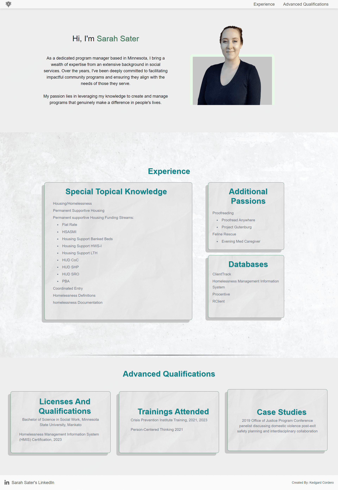

# **Sarah Sater Resume Portfolio**

## **Table of Contents**
- [License](#license)
- [Technologies Used](#technologies-used)
- [Project Overview](#project-overview)
- [Inspiration](#inspiration)
- [Unique Technologies](#unique-technologies)
- [Deployment](#deployment)

## **License**
This project is licensed under the MIT license.

## **Technologies Used**
* React.js
* TypeScript (JavaScript)
* TailwindCSS
* HTML

## **Project Overview**
I was contacted by Sarah Sater, a social worker seeking promotion. She wished for a more impactful alternative to a standard resume to stand out among other candidates. Upon securing the new role, she intends to add features to her professional profile, including a 'contact me' section and a resume download option.

## **Inspiration**
Having built multiple portfolios for clients in the past, I wanted to learn a new framework. I had heard great things about Tailwind, and decided to implement it in this current project.

## **Unique Technologies**
**Tailwind**

Tailwind CSS is a utility-first CSS framework that provides a set of low-level, single-purpose CSS classes that can be used to style web pages. This makes it easy to quickly and easily create custom designs without having to write a lot of custom CSS.

## **Deployment**
[Deployment Link](https://sarah-sater.netlify.app/)